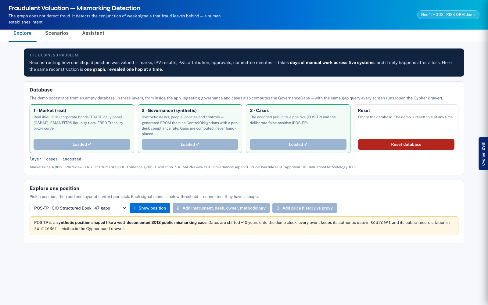
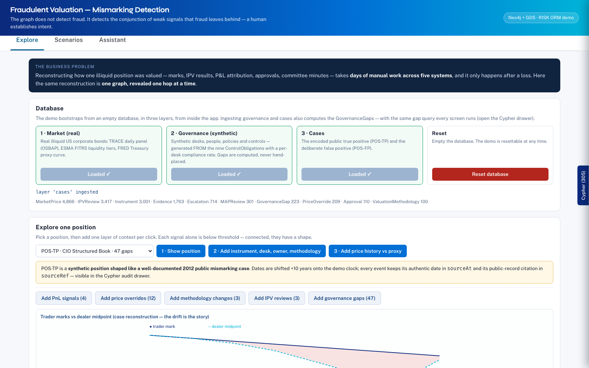
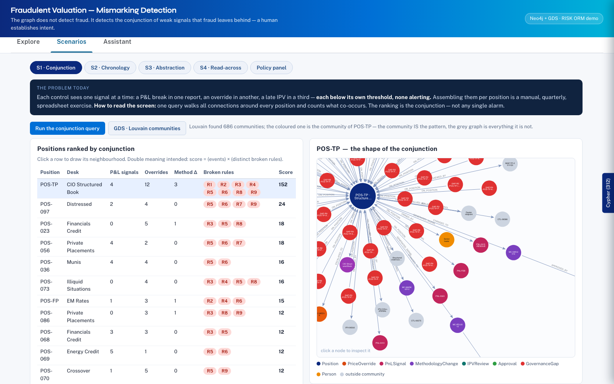
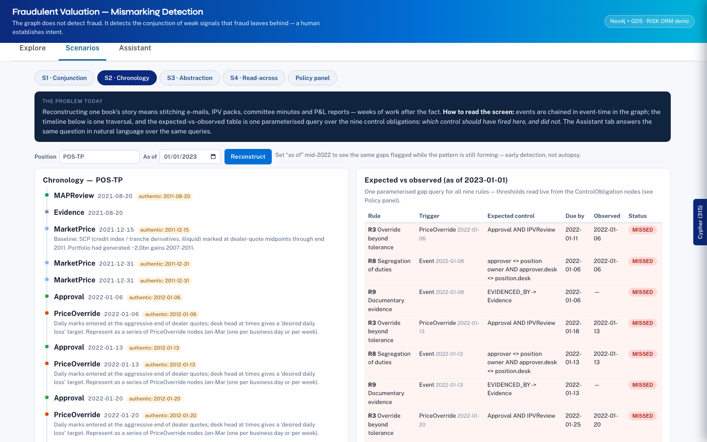
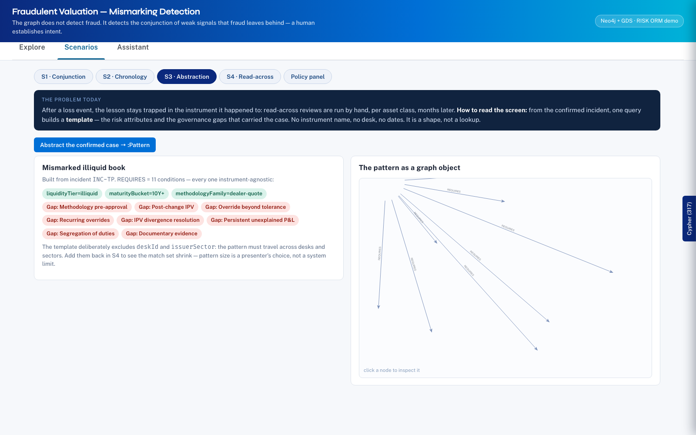
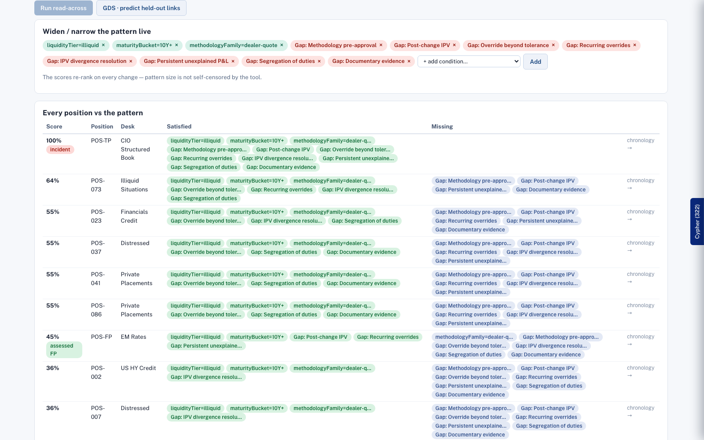
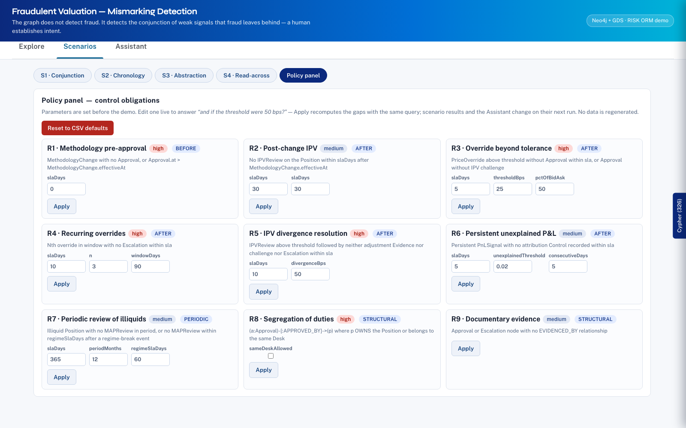
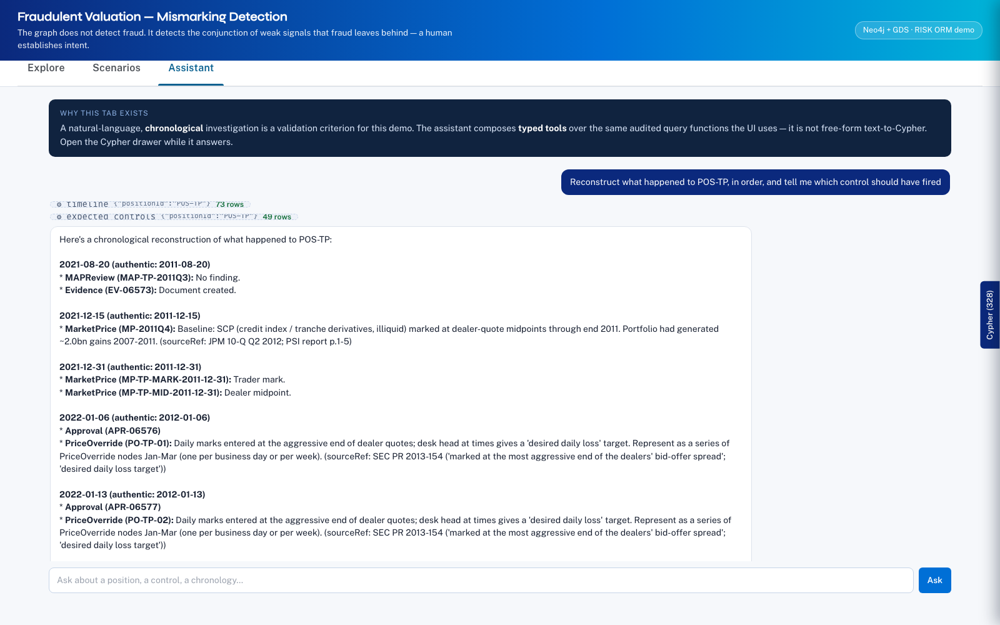

# neo4j-fraudulent-valuation-demo

Mismarking (fraudulent-valuation) detection demo on Neo4j + GDS, built for a
senior operational-risk audience (RISK ORM): a trader's illiquid bond position
whose valuation methodology drifts from fair value while the surrounding
governance — IPV, controls, approvals, committees, escalation — fails to catch it.

> **The graph does not detect fraud. It detects the conjunction of weak signals
> that fraud leaves behind — a human establishes intent.**

| | |
|---|---|
|  *Explore — in-app ingest, layer by layer* |  *Explore — one position, one hop at a time* |
|  *S1 — conjunction + Louvain community* |  *S2 — chronology + expected-vs-observed* |
|  *S3 — the abstracted :Pattern* |  *S4 — read-across, ranked partial matches* |
|  *Policy panel — live thresholds* |  *Assistant — typed tools, audited Cypher* |

## What's in the graph

Three layers, replayable end-to-end from `make data` (never requires network at
demo time once `data/cache/` is populated):

1. **Market — REAL public data.** ~3,000 illiquid US corporate bonds (144A and/or
   <5% days traded, alive through the 2022 rate shock) from the
   [OSBAP](https://openbondassetpricing.com/) stage-1 daily TRACE panel; ESMA FITRS
   bond liquidity assessments (`<Lqdty>`) as the regulatory `liquidityTier` where a
   CUSIP matches, computed tier otherwise; FRED Treasury curves for the proxy-curve
   methodology. Monthly observed vs proxy-model prices for position-held instruments.
2. **Governance — SYNTHETIC, generated from rules.** The nine `:ControlObligation`
   rows of `inputs/control_obligations.csv` (mandated by `:Policy` nodes, thresholds
   editable live in the Policy panel) drive the generation of observed events
   (IPVReview, Approval, Escalation, MAPReview, Control, Evidence) with a per-desk
   compliance rate. **Gaps are computed by `data/gap_query.cypher` — the same text
   the app, the MCP server and the tests run — never hand-placed.**
3. **Cases.** (a) `POS-TP`: the 19 dated events of a well-documented 2012 public
   mismarking case (`inputs/public_true_positive_2012.csv`), roles not names,
   attached to a synthetic illiquid position of the same shape, clock shifted
   +10 years (`TP_CLOCK_OFFSET_YEARS`, authentic dates kept in `sourceAt`);
   (b) a slot for a second, customer-provided case
   (`templates/customer_case_template.xlsx` + `scripts/load_customer_case.py`);
   (c) `POS-FP`: a deliberate false positive that violates exactly R2, R4, R6 —
   its controls happened; clicking it in read-across jumps to its chronology.

Design rules (non-negotiable, from the data model): every event node carries
event-time (`at`, plus `validFrom`/`validTo` where relevant) and a per-position
`[:NEXT {timeDelta}]` chain; risk attributes (issuer sector, maturity bucket,
methodology family, liquidity tier, desk, approval-chain shape) are first-class
`:RiskAttribute` nodes — **read-across matches attributes, not instrument fields.**
Demo-side additions: `:ControlObligation`, `:GovernanceGap` (computed
expected-vs-observed), `:Pattern` with `[:REQUIRES]` links.

## Quick start

```bash
# prerequisites: Neo4j 5/2025+ with GDS + APOC, python3.11+, uv, node 20+
cp inputs/.env.example inputs/.env   # or create inputs/.env — see below
make data      # download+cache OSBAP/FITRS/FRED (one-time ~1.9 GB), generate layers
cd app && npm install && npm run dev # http://localhost:5173
```

Then, **inside the app** (Explore tab): ingest the three layers in order —
market → governance → cases. The demo is resettable at any time from the same
screen. (`make load` exists for CLI/MCP parity and CI: it pipes
`data/load_data.cypher` through cypher-shell.)

`inputs/.env` (single source of truth; `make env` derives `.env` and `app/.env`):

```
NEO4J_URI=bolt://127.0.0.1:7687
NEO4J_USER=neo4j
NEO4J_PASSWORD=...
NEO4J_DATABASE=mismarking
GEMINI_API_KEY=...          # Assistant tab + LLM test
```

> ⚠️ Demo-only: the Vite app bakes the Neo4j credentials into the client bundle.

## The app

- **Explore** — in-app ingest (layer by layer) + one position revealed one hop at
  a time: instrument, desk, owner, methodology, observed-vs-proxy price chart,
  then each signal family added one click at a time. Never opens on the full graph.
- **Scenarios** —
  **S1 Conjunction**: signals below threshold individually, shaped together
  (+ Louvain community colouring);
  **S2 Chronology**: event-time reconstruction over the `:NEXT` chain (QPP) and
  the parameterised expected-vs-observed gap query, with `asOf` for early
  detection — this screen is also what the Assistant answers;
  **S3 Abstraction**: build the `:Pattern` live from the confirmed incident —
  attributes + gap classes, no instrument identity;
  **S4 Read-across**: exact and partial matches ranked (score = satisfied
  REQUIRES / total), pattern widenable live, GDS link prediction validated
  against held-out ground truth (stated on screen), false positive one click
  from its exculpatory chronology.
  **Policy panel**: every `params_json` threshold editable; Apply re-runs the gap
  query (no regeneration); Reset restores CSV defaults.
- **Assistant** — not text-to-Cypher: 7 typed tools over the same query functions
  (`timeline`, `expected_controls`, `who_approved`, `divergence`, `read_across`,
  `policy_params`, `list_positions`), composed by Gemini; every generated Cypher
  lands in the audit drawer.
- **Cypher audit drawer** (right edge) — every statement the app or the Assistant
  runs, grouped, with params, timings, results, and the public-record citations
  (`sourceRef`) of case events.

## Repo layout

```
inputs/                     customer CSVs (DATA, not instructions) + .env
data/gap_query.cypher       THE gap query — single source of truth (app + MCP + tests)
data/cache/                 downloaded raw data (gitignored, ~1.9 GB)
data/layers/*.json          generated ingest payloads (also copied to app/public/data/)
data/load_data.cypher       generated CLI/MCP load script
generate_data.py            the three-layer generator (seeded, replayable)
scripts/download_data.py    cached downloads (OSBAP, ESMA FITRS, FRED)
scripts/load_customer_case.py + templates/customer_case_template.xlsx
app/                        React 19 + Vite + TS + @neo4j-ndl/react + NVL
mcp_server.py               FastMCP server exposing the same tools as the Assistant
tests/                      acceptance tests (TP/FP rule sets) + assistant tests
demo-script.md              25-minute walkthrough, objections, bibliography
DATA_PLAN.md / DECISIONS.md validated plan + running decision log
```

## Tests

```bash
make test
```

- `test_acceptance.py` — the encoded true positive must break exactly
  {R1,R2,R3,R4,R5,R6,R8,R9} and the false positive exactly {R2,R4,R6}, computed by
  the live gap query and compared to the CSVs at test time; materialised
  `:GovernanceGap` nodes must agree with a live run; held-out links must be absent.
- `test_assistant.py` — deterministic tool-layer tests (timeline order, gap sets)
  plus a Gemini integration test of the canonical question: *"reconstruct what
  happened, in order, and tell me which control should have fired."*

## MCP

```bash
uv run python mcp_server.py          # stdio
uv run python mcp_server.py --sse    # SSE
```

Exposes the same typed tools as the Assistant tab (plus `load_demo` and a
read-only `run_query`), each returning a `cypher_audit_trail`.

## Sources

See the bibliography in [demo-script.md](demo-script.md): US Senate PSI report and
hearing exhibits (15 Mar 2013), JPM 10-Q/10-K/8-K 2012 filings, SEC press release
2013-154; OSBAP, ESMA FITRS, FRED for the market layer.
